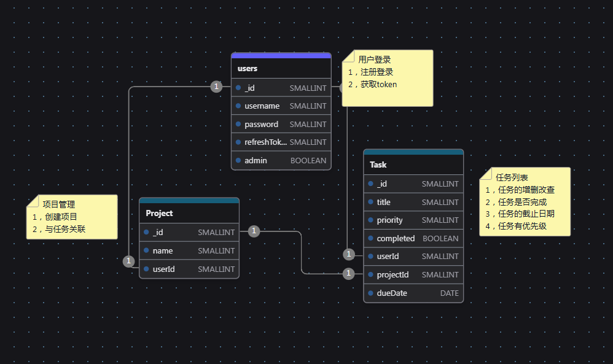

# todo-app
# #待办事项应用
本人是一名前端人，在努力向全栈进发，以下是自己目前的学习的技术栈，希望大佬提提建议

- **前端**: 使用HTML, CSS, JavaScript, Vue/React.js
- **后端**: 使用Node.js和Koa2 + ts
- **数据库**: MongoDB


# 项目构建
## 前端：vue3 + vite + ts
### 项目结构
```
web/
├── public/
├── src/
│   ├── assets/            # 静态资源
│   ├── components/        # Vue 组件
│   ├── router/            # Vue Router 配置
│   ├── store/             # 状态管理（Vuex 或 Pinia）
│   ├── views/             # 页面组件
│   ├── App.vue            # 根组件
│   ├── main.ts            # 入口文件
│   └── utils/             # 工具函数
├── tsconfig.json          # TypeScript 配置
└── package.json           # 项目依赖和脚本
```
### 前端功能需求：
- 用户注册和登录：支持用户注册和登录，使用JWT进行身份验证。
- 任务管理：用户可以添加、编辑、删除、完成任务，任务有优先级、截止日期等属性。
- 项目管理：用户可以创建项目，每个项目下包含多个任务。
- 统计和报告：可以查看任务的完成情况统计，支持导出报告。
### 主要页面：
- 登录/注册页面：用户输入用户名和密码进行身份验证。
- 任务列表页面：显示用户当前所有的任务，并支持按项目、日期等过滤。
- 任务详情页面：查看并编辑单个任务的详细信息。
- 项目管理页面：用户可以创建、编辑和删除项目。

# 后端：Koa2 + TypeScript
### 项目结构
```
server/
├── src/
│   ├── controllers/       # 控制器，处理请求和响应
│   ├── models/            # 数据模型，定义数据库结构
│   ├── routes/            # 路由，定义API接口
│   ├── services/          # 服务，处理业务逻辑
│   ├── utils/             # 工具函数，如日志、错误处理等
│   ├── app.ts             # 应用入口文件
│   └── config.ts          # 配置文件，如数据库连接等
├── tsconfig.json          # TypeScript 配置
└── package.json           # 项目依赖和脚本
```
## 后端功能需求：
- 用户管理：提供用户注册、登录、身份验证、密码加密等功能。
- 任务管理：提供任务的CRUD（创建、读取、更新、删除）接口，支持分页查询。
- 项目管理：提供项目的CRUD接口，并关联任务。
- 权限管理：确保用户只能操作自己的数据。
- 日志和监控：记录操作日志，并通过监控系统保障应用的健康运行。
## 主要API接口：
- POST /api/auth/register - 用户注册
- POST /api/auth/login - 用户登录，返回JWT
- GET /api/tasks - 获取当前用户的任务列表
- POST /api/tasks - 创建任务
- PUT /api/tasks/:id - 更新任务
- DELETE /api/tasks/:id - 删除任务
- GET /api/projects - 获取当前用户的项目列表
- POST /api/projects - 创建项目
- PUT /api/projects/:id - 更新项目
- DELETE /api/projects/:id - 删除项目
## 中间件：
- 身份验证中间件：使用JWT对API请求进行身份验证。
- 错误处理中间件：统一处理后端错误并返回标准化的错误信息。
- 日志记录中间件：记录API请求和响应日志，方便调试和监控。

# 数据库：MongoDB
## 数据模型：
### 用户模型 (User)：
- username: 字符串，唯一
- password: 哈希后的密码
- email: 字符串，唯一
- createdAt: 创建时间
### 任务模型 (Task)：
- title: 任务标题
- description: 任务描述
- priority: 任务优先级（低、中、高）
- dueDate: 截止日期
- completed: 是否完成
- projectId: 关联的项目ID
- userId: 任务所属的用户ID
- createdAt: 创建时间
### 项目模型 (Project)：
- name: 项目名称
- description: 项目描述
- userId: 项目所属的用户ID
- createdAt: 创建时间


# 项目截图


# 项目部署

1. 克隆项目到本地
2. 安装依赖：在server和web目录下运行 `npm install`
3. 启动后端服务：在server目录下运行 `npm run dev`
4. 启动前端服务：在web目录下运行 `npm run dev`
5. 访问：http://localhost:9000

# 项目说明

纯个人练手项目，如有不足之处，请指正。